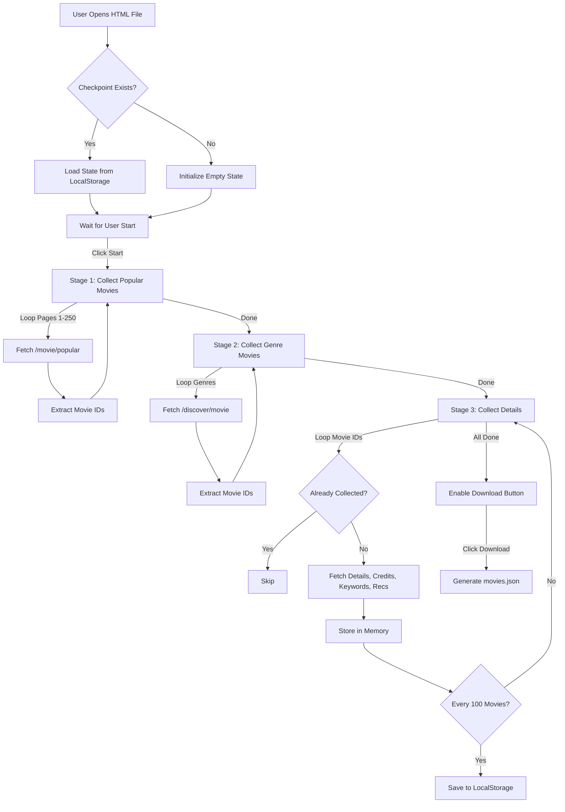

# Execution Flow: Browser-Based Data Collection

This document outlines the step-by-step flow of data and user interaction within the `browser_tmdb_collector.html` tool.

## Visual Flowchart

## Detailed Step-by-Step

### 1. Initialization
-   **User Action**: Double-clicks `browser_tmdb_collector.html`.
-   **System**:
    -   Browser loads HTML/CSS/JS.
    -   `window.onload` triggers `loadCheckpoint()`.
    -   Checks `localStorage` for key `tmdb_checkpoint`.
    -   **If found**: Restores `movieIds` and `completeMovies`, updates UI stats.
    -   **If not found**: Sets counters to 0.

### 2. The Collection Loop (The "Start" Button)
-   **User Action**: Clicks "Start Collection".
-   **System**:
    -   Disables "Start", enables "Pause".
    -   Sets `isRunning = true`.

    **Phase A: ID Harvesting (Fast)**
    -   The script hits the `popular` endpoint 250 times.
    -   Then hits `discover` endpoint for 19 genres x 25 pages each.
    -   **Result**: A Set of ~6,000 unique Movie IDs.

    **Phase B: Detail Enrichment (Slow)**
    -   The script iterates through the Set of IDs.
    -   For each ID `12345`:
        1.  `GET /movie/12345` (Basic info)
        2.  `GET /movie/12345/credits` (Actors/Directors)
        3.  `GET /movie/12345/keywords` (Tags)
        4.  `GET /movie/12345/recommendations` (Graph connections)
    -   **Rate Limiting**: Sleeps 250ms before *each* of these 4 calls. Total ~1 second per movie.

### 3. Persistence & Safety
-   **Automatic**: Every 100 movies processed in Phase B, the system serializes the entire `completeMovies` object and saves it to the browser's internal storage.
-   **Manual**: If the user clicks "Pause", it immediately saves the current state.

### 4. Completion & Export
-   **Trigger**: When the loop finishes processing all IDs.
-   **System**:
    -   Logs "Collection complete!".
    -   Enables the "Download Data" button.
-   **User Action**: Clicks "Download Data".
-   **Result**: Browser downloads `movies.json` (approx 15-20MB size) to the user's Downloads folder.

### 5. Post-Processing (External)
-   **User Action**: Moves `movies.json` to `d:\PROJECTS\StreamSage\services\movie-assistant-service\data\raw\`.
-   **Next Step**: The Python pipeline takes over for Feature Engineering.
