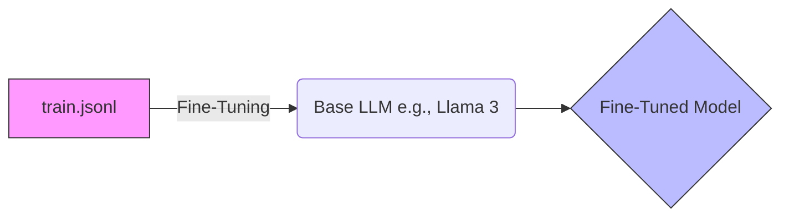
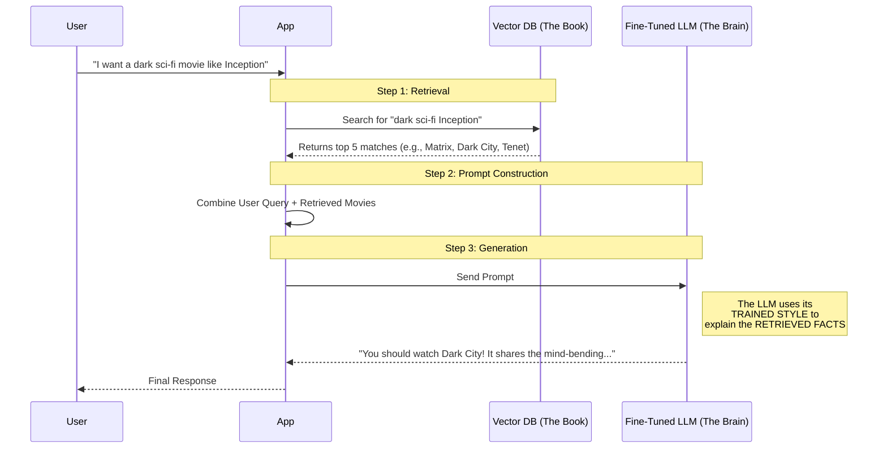

# RAG Inference Flow: How It All Works Together

You asked exactly the right question: *"How does the user query, vector DB, and training file all come together?"*

Here is the step-by-step flow of what happens when a user asks a question.

## The Big Picture

There are two separate phases:
1.  **Training Phase (Offline):** Where the "Brain" learns the style.
2.  **Inference Phase (Runtime):** Where the "Brain" uses the "Book" to answer.

---

## Phase 1: Training (What we just finished)
**Goal:** Teach the LLM *how* to be a Movie Assistant.

*   **Input:** `train.jsonl` (3,000 examples of good conversations).
*   **Process:** We update the weights of the model.
*   **Result:** A **Fine-Tuned Model** that knows:
    *   To be enthusiastic ("You'll love this!").
    *   To format lists with bold titles.
    *   To explain *why* a movie matches.
    *   **Crucially:** It does NOT memorize the movies in `train.jsonl`. It memorizes the *pattern*.

---

## Phase 2: Inference (Runtime Flow)
**Goal:** Answer a user's specific question using the full database.

**Scenario:** User asks: *"I want a dark sci-fi movie like Inception."*

### Detailed Breakdown

#### Step 1: Retrieval (The "Book")
The app takes the user's query and searches your **Vector Database** (which contains all 6,000 movies).
*   **Input:** "dark sci-fi like Inception"
*   **Vector DB:** Finds movies mathematically similar to that concept.
*   **Output:**
    1.  *The Matrix* (Relevance: 95%)
    2.  *Dark City* (Relevance: 92%)
    3.  *Tenet* (Relevance: 89%)

#### Step 2: The Prompt (The Bridge)
The app pastes these facts into a prompt for the LLM. It looks like this:

> **System:** You are a helpful movie assistant.
>
> **Context (Facts from DB):**
> 1. Title: The Matrix, Plot: A hacker discovers reality is a simulation...
> 2. Title: Dark City, Plot: A man struggles with memories in a nightmarish city...
>
> **User Query:** "I want a dark sci-fi movie like Inception."

#### Step 3: Generation (The "Brain")
This is where your **Fine-Tuned Model** shines.
*   It receives the prompt above.
*   It recognizes the task: *"Ah, I know how to do this! I learned it from `train.jsonl`!"*
*   It takes the **facts** from the Context (Matrix, Dark City).
*   It applies the **style** from the Training (Enthusiastic, structured).

**Final Output:**
> "Since you liked *Inception*, you have to check out **Dark City**! It's a visually stunning, dark sci-fi noir that explores memory and reality, just like Nolan's masterpiece."

### Summary
*   **`train.jsonl`:** Teaches the **Style** (Offline).
*   **Vector DB:** Provides the **Facts** (Runtime).
*   **RAG:** Combines them so the AI can talk about *any* movie in your database with the perfect personality.
