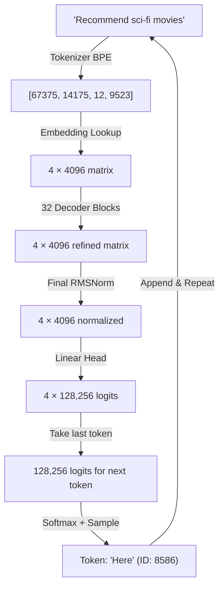
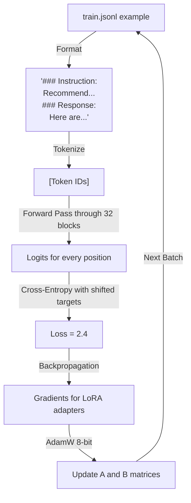

# Execution Flow: Data Through the LLaMA 3 Architecture

This document traces the exact journey of data through LLaMA 3 8B — from raw text input to generated output token — mapping every step to the architecture diagram.

---

## Flow 1: Inference (Generating a Response)

This is the **green path** in the architecture diagram (Input Block → Decoder Blocks → Output Block → Output Token).

### Step-by-Step: "Recommend sci-fi movies"



### Detailed Walk-Through

#### Phase 1: Tokenization
```
Input:   "Recommend sci-fi movies"
Tokens:  ["Recommend", " sci", "-fi", " movies"]
IDs:     [67375, 14175, 12, 9523]
Shape:   [4]  (4 tokens)
```
The tokenizer splits text into subwords. Note that "sci-fi" becomes two tokens because the hyphenated form wasn't frequent enough in training data to get its own token.

#### Phase 2: Embedding
```
Input:   [67375, 14175, 12, 9523]
Process: Look up each ID in the embedding table (128,256 × 4,096)
Output:  [[0.023, -0.145, ...],   ← "Recommend" (4,096 numbers)
          [0.891, 0.034, ...],    ← " sci"
          [-0.445, 0.112, ...],   ← "-fi"
          [0.567, -0.892, ...]]   ← " movies"
Shape:   [4, 4096]
```

#### Phase 3: Decoder Block 1 (of 32)

**Step 3a: Pre-Attention RMSNorm**
```
x_norm = RMSNorm(x)
    = x / sqrt(mean(x²)) * γ
Shape: [4, 4096] → [4, 4096]  (same shape, just rescaled)
```

**Step 3b: Q, K, V Projections**
```
Q = x_norm · W_Q    Shape: [4, 4096] × [4096, 4096] → [4, 4096]
K = x_norm · W_K    Shape: [4, 4096] × [4096, 1024] → [4, 1024]
V = x_norm · W_V    Shape: [4, 4096] × [4096, 1024] → [4, 1024]
```
Q is split into 32 heads: [4, 32, 128]
K is split into 8 heads:  [4, 8, 128]
V is split into 8 heads:  [4, 8, 128]

**Step 3c: RoPE on Q and K**
```
For each head, for each position m:
  For each dimension pair (2i, 2i+1):
    q'[2i]   = q[2i]·cos(mθᵢ) - q[2i+1]·sin(mθᵢ)
    q'[2i+1] = q[2i]·sin(mθᵢ) + q[2i+1]·cos(mθᵢ)
    (same for k)
```
Now "Recommend" at position 0 and "movies" at position 3 have different rotations. The attention score between them will reflect that they are 3 positions apart.

**Step 3d: GQA Attention**
```
For each of 32 query heads (sharing KV heads in groups of 4):
  scores = Q_head · K_group^T / √128       Shape: [4, 4] per head
  scores = causal_mask(scores)               Future positions → -∞
  weights = softmax(scores)                  Shape: [4, 4] per head (rows sum to 1)
  output_head = weights · V_group            Shape: [4, 128] per head

Concat all 32 heads: [4, 32×128] = [4, 4096]
```

The causal mask for our 4 tokens:
```
Token:     Rec    sci    -fi   movies
Rec:    [ 1.0,  -∞,    -∞,    -∞   ]   ← "Recommend" only sees itself
sci:    [ 0.4,  0.6,   -∞,    -∞   ]   ← "sci" sees "Recommend" and itself
-fi:    [ 0.1,  0.5,   0.4,   -∞   ]   ← "-fi" sees 3 tokens
movies: [ 0.2,  0.3,   0.2,   0.3  ]   ← "movies" sees everything
```

**Step 3e: Output Projection**
```
attention_out = concat_heads · W_O    Shape: [4, 4096] × [4096, 4096] → [4, 4096]
```

**Step 3f: First Residual Connection**
```
x = x + attention_out    (element-wise addition)
Shape: [4, 4096]
```
This "adds" the attention's findings back to the original input.

**Step 3g: Pre-FFN RMSNorm**
```
x_norm2 = RMSNorm(x)
Shape: [4, 4096]
```

**Step 3h: SwiGLU Feed-Forward Network**
```
gate = x_norm2 · W_gate     Shape: [4, 4096] × [4096, 14336] → [4, 14336]
up   = x_norm2 · W_up       Shape: [4, 4096] × [4096, 14336] → [4, 14336]

hidden = SiLU(gate) ⊙ up    Shape: [4, 14336]  (element-wise multiply)
output = hidden · W_down     Shape: [4, 14336] × [14336, 4096] → [4, 4096]
```
SiLU(x) = x × sigmoid(x). The gate decides what information passes through.

**Step 3i: Second Residual Connection**
```
x = x + output
Shape: [4, 4096]
```

#### Phase 4: Repeat for Blocks 2-32
The output of Block 1 becomes the input of Block 2, and so on through all 32 layers. Each layer has **different weights** but the **same structure**.

#### Phase 5: Output Block
```
x_final = RMSNorm(x)                          Shape: [4, 4096]
logits = x_final · W_vocab^T                   Shape: [4, 128256]
```

We only care about the **last token's** logits (position 3, "movies"):
```
next_token_logits = logits[3]                   Shape: [128256]
```

#### Phase 6: Token Selection
```
# Apply temperature
scaled_logits = next_token_logits / 0.7

# Apply top-p (nucleus sampling)
sorted_probs = softmax(sorted(scaled_logits))
keep tokens until cumulative prob ≥ 0.9

# Apply repetition penalty
for token in already_generated:
    scaled_logits[token] /= 1.2

# Sample
next_token = sample from filtered distribution
→ "Here" (ID: 8586)
```

#### Phase 7: Autoregressive Loop + KV Cache
```
Iteration 1: ["Recommend", "sci", "-fi", "movies"] → "Here"
  KV Cache: Store K₁,V₁ for all 4 tokens across all 32 layers

Iteration 2: ["Recommend", "sci", "-fi", "movies", "Here"] → "are"
  KV Cache: Reuse K₁,V₁ for tokens 1-4, only compute K,V for "Here"

Iteration 3: [..., "Here", "are"] → "some"
  KV Cache: Reuse everything, only compute K,V for "are"

... continues until <|eot_id|> or max_tokens reached
```

**KV Cache per layer per token:**
```
K: 8 heads × 128 dim × 2 bytes = 2,048 bytes
V: 8 heads × 128 dim × 2 bytes = 2,048 bytes
Total: 4,096 bytes per token per layer
All 32 layers: 4,096 × 32 = 131,072 bytes (128 KB) per token
```

---

## Flow 2: Training (Learning from Data)

This is the **blue path** in the architecture diagram (same forward pass, PLUS Loss → Backpropagation → Update Weights).

### Step-by-Step: Learning One Example



### Detailed Walk-Through

#### Step 1: Data Preparation
```
Input from train.jsonl:
{
  "instruction": "Recommend 3 movies like Inception",
  "response": "Here are 3 mind-bending films:\n1. **Shutter Island** (2010)..."
}

Formatted (Llama 3 template):
<|begin_of_text|><|start_header_id|>user<|end_header_id|>
Recommend 3 movies like Inception<|eot_id|>
<|start_header_id|>assistant<|end_header_id|>
Here are 3 mind-bending films:
1. **Shutter Island** (2010)...<|eot_id|>

Tokenized: [128000, 128006, 882, 128007, ..., 128009]
Length: ~150 tokens
```

#### Step 2: Sequence Packing (if enabled)
```
Without packing:     [Example1, PAD, PAD, PAD, ..., PAD]  (2048 positions, mostly waste)
With packing:        [Example1, Example2, Example3, ...]    (2048 positions, fully used)
```
Multiple short examples are packed into one sequence with attention masks preventing cross-contamination.

#### Step 3: Forward Pass (Same as Inference)
Data flows through all 32 decoder blocks. The key difference:
- **No KV Cache** (we process the full sequence at once)
- **All positions computed in parallel** (not autoregressive)
- **Activations are saved** for the backward pass (unless gradient checkpointing discards them)

Output: Logits for **every position** in the sequence.

#### Step 4: Loss Computation
```
For each position i in the sequence:
  prediction = logits[i]        (128,256 probabilities)
  target = input_ids[i + 1]     (the NEXT token — shifted by 1)
  loss_i = -log(prediction[target])

Total loss = mean(loss_i for all positions)
```

**The "shift by 1" is crucial:** We train the model so that the logits at position i predict the token at position i+1. This is the **autoregressive training objective**.

```
Position:       0           1         2         3
Input:      "Recommend"   "sci"     "-fi"    "movies"
Target:       "sci"       "-fi"    "movies"   "like"
                ↑           ↑         ↑          ↑
           Predict this  from this position
```

**We only compute loss on the RESPONSE tokens**, not the instruction. The model should learn to generate good responses, not to memorize the prompts.

#### Step 5: Backpropagation
```
Gradients flow backward:
  Output Head (Linear) ← Block 32 ← Block 31 ← ... ← Block 1 ← Embeddings

But ONLY the LoRA adapter matrices (A, B) receive gradient updates.
The base model weights are frozen (no gradients computed for them).
```

With our configuration:
- **32 layers × 7 target modules × 2 matrices (A, B)** = 448 trainable matrices
- Each A: [4096, 32], each B: [32, output_dim]
- Total trainable: ~42M parameters (0.5% of 8B)

#### Step 6: Gradient Accumulation
```
Batch 1: Forward → Loss → Gradients (stored, not applied)
Batch 2: Forward → Loss → Gradients (accumulated)
Batch 3: Forward → Loss → Gradients (accumulated)
Batch 4: Forward → Loss → Gradients (accumulated)
→ NOW: Apply accumulated gradients (effective batch size = 6 × 4 = 24)
→ Reset gradients, repeat
```

#### Step 7: Weight Update (AdamW 8-bit)
```
For each LoRA parameter p:
  m = β₁ · m + (1 - β₁) · gradient           (momentum - stored in 8-bit)
  v = β₂ · v + (1 - β₂) · gradient²          (velocity - stored in 8-bit)
  p = p - lr · m / (√v + ε) - wd · p          (update)
```

The optimizer states (m, v) are stored in **8-bit** format to save memory. For our ~42M trainable parameters:
- FP32 optimizer: 42M × 2 states × 4 bytes = 336 MB
- **8-bit optimizer: 42M × 2 states × 1 byte = 84 MB** (4x savings)

#### Step 8: Learning Rate Schedule
```
Step 0-15:   Warmup from 0 → 2e-4      (5% of total steps)
Step 15-300: Cosine decay 2e-4 → ~0     (95% of steps)

      lr
  2e-4 |     /‾‾‾‾‾‾‾\
       |    /          \
       |   /            \
       |  /              \
    0  | /                \___
       +------------------------→ steps
         0   15          300
```

---

## Flow 3: LoRA Merge (Deployment)

After training, we need to merge the adapters with the base model or keep them separate.

### Option A: Keep Separate (For Inference with PEFT)
```
Base Model (5.5GB, 4-bit) + LoRA Adapters (~100MB)
→ Load base model → Load adapters on top → Inference
```

### Option B: Merge + Export GGUF (For Ollama)
```
1. Load base model (16-bit)
2. Merge LoRA adapters into base weights:
     W_new = W_base + (α/√r) × A × B    (for each target module)
3. Quantize merged model to GGUF Q4_K_M format
4. Deploy to Ollama
```

### Option C: Merge + vLLM (For Production)
```
1. Load base model (16-bit)
2. Merge LoRA adapters into base weights
3. Save as full 16-bit model
4. Load in vLLM with PagedAttention
```

---

## Numerical Example: One Attention Head

To make this concrete, here's a toy example with dimension 4 (real dimension is 128):

```
Input token embeddings (after RMSNorm):
  "Recommend" = [1.0, 0.5, -0.3, 0.8]
  "movies"    = [0.7, -0.2, 0.9, 0.1]

Q, K, V weight matrices (4×4 for this toy example):
  W_Q = [[0.1, 0.2],    W_K = [[0.3, -0.1],    W_V = [[0.5, 0.1],
         [0.3, -0.1],          [-0.2, 0.4],           [0.2, -0.3],
         [-0.2, 0.5],          [0.1, 0.3],            [-0.1, 0.4],
         [0.4, 0.1]]          [0.2, -0.2]]           [0.3, 0.2]]

Step 1: Q = input · W_Q
  Q_recommend = [1.0·0.1 + 0.5·0.3 + (-0.3)·(-0.2) + 0.8·0.4,  ...] = [0.63, ...]
  Q_movies    = [0.7·0.1 + (-0.2)·0.3 + 0.9·(-0.2) + 0.1·0.4,  ...] = [-0.13, ...]

Step 2: Apply RoPE rotation to Q and K at their positions
  (rotates vectors by position-dependent angle)

Step 3: Attention score = Q · K^T / √d
  score("movies" attending to "Recommend") = Q_movies · K_recommend / √2

Step 4: Softmax → weights

Step 5: Output = weights · V
  "movies" output = 0.4 × V_recommend + 0.6 × V_movies
  (weighted combination of value vectors based on attention weights)
```

---

## Summary

| Flow | Path in Diagram | Key Difference |
| :--- | :--- | :--- |
| **Inference** | Input → 32 Blocks → Softmax → Token | Uses KV Cache, one token at a time |
| **Training** | Input → 32 Blocks → Loss → Backprop | Full sequence, loss on all positions |
| **LoRA Training** | Same as training | Only adapter weights updated |
| **Deployment** | Merge adapters → Export | Adapters baked into base weights |
